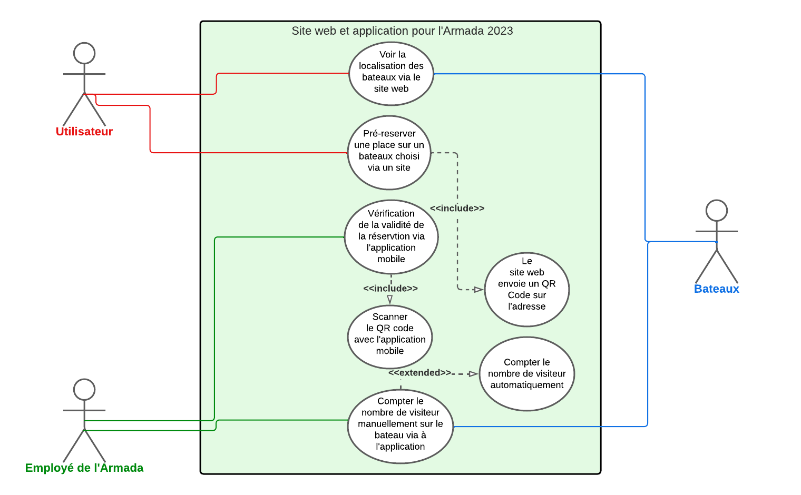
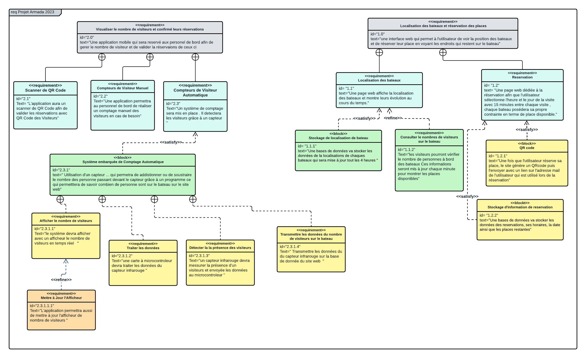
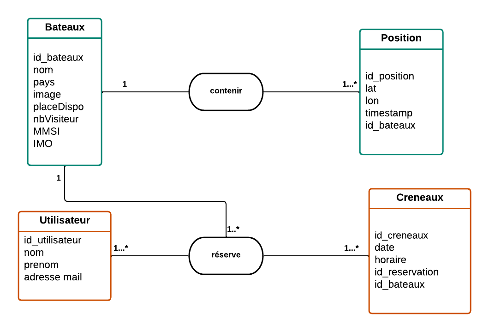
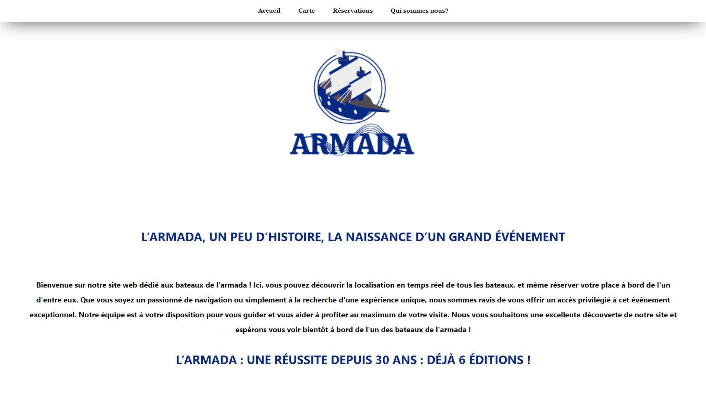
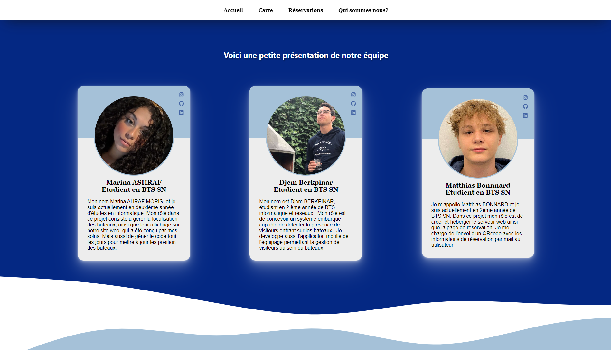

# Armada_Project
Un site pour l'armada pour localiser les bateaux de l'armada mais aussi réserver une place sur le bateau souhaité. 

#Tâches personnelles
. Programme de récupération automatisée et stockage en base de données des positions des bateaux.
. Création du site web permettant de visualiser sur une carte la position des bateaux à une date donnée ainsi que l’évolution de cette position au cours du temps.

#Les Diagrammes d'explication du projet

*Digramme du cas d'utilisation

*Digramme d'exigences

*Digramme de déploiement

*Digrammes de séquences

*Digramme MCD

*Digramme MPD

* Page d'accueil : Sur cette page, vous pouvez trouver notre logo de l'Armada, accompagné d'une brève description de l'armada.
  

* Page de la carte : Sur cette page, vous pouvez observer une carte qui indique les positions des bateaux, ainsi que le nombre de visiteurs à bord de chaque navire. De plus, nous disposons d'un système qui permet de remonter dans le temps en utilisant la carte, afin d'observer les déplacements des bateaux au fil du temps.
  

* Page de réservation : Cette page propose un bouton qui redirige vers une page de réservation créée par mon collègue.
  

* Page de Présentaion : Sur cette page, j'ai l'intention de me présenter ainsi que mes camarades avec lesquels nous avons réalisé ce projet. Sous chaque photo, vous trouverez les tâches attribuées à chacun d'entre nous.
  

# Technologies utilisées:
* HTML
* CSS
* PHP
* JavaScript

# Comment utiliser le site
Pour accéder au site, vous pouvez simplement télécharger le projet et ouvrir le fichier index.html dans votre navigateur web préféré.

# Contributions
Les contributions à ce projet sont les bienvenues ! Si vous souhaitez apporter des améliorations ou corriger des bugs, n'hésitez pas à ouvrir une pull request.

# Auteurs
Ce projet a été réalisé par Marina ASHRAF MORIS dans le cadre d'un projet universitaire.

# Licence
Ce projet est sous licence MIT.
